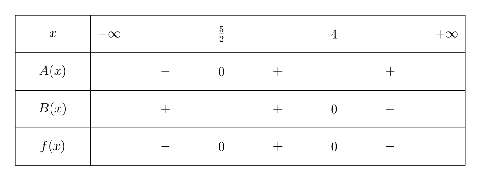

# Chapitre 1 - Bien démarrer avec les fonctions affines

## Définition

Soit $a$, $b$ deux réels fixés au départ. La fonction affine $f$ définie sur $\mathbb{R}$ par $f(x)=ax+b$ est représentée par la droite d'équation $y=ax+b$ où $a$ est le coefficient directeur et $b$ l'ordonnée à l'origine.

{: .center width=50%}

## Exemple

!!! example "Exemple 1"
    === "Énoncé"
        1. Déterminer graphiquement les expression de $f(x)$ et $g(x)$.
        2. Représenter les fonctions définies sur $\mathbb{R}$ par $h(x)=x+3$ et $k(x)=1$.
        3. Resoudre graphiquement $f(x)=5$, $g(x)=1$ et $f(x)=g(x)$.

        {: .center width=50%}
    === "Correction"
        1. $f(x)=0.5x+2$ (ou $f(x)=\frac{1}{2}x+2$)
        
            $g(x)=-2x+4$.
        2. TODO
        3. $f(x)=5$ a pour solution $x=6$
        
            $g(x)=1$ a pour solution $x=1.75$ 
            
            $f(x)=g(x)$ a pour solution $x=1$

## Propriété
$f(x)=ax+b$, $x\in\mathbb{R}$.

- $f$ est croissante sur $\mathbb{R}$ si et seulement si $a\geq0$: "$a$ positif".
- $f$ est décroissante sur $\mathbb{R}$ si et seulement si $a\leq0$: "$a$ négatif".

    ### Remarque
    Les fonctions croissantes sont d'abords négatives puis positives alors qu'une fonction décroissante est d'abord positive puis négative.

## Application

!!! example "Exercice d'application 1"
    === "Énoncé"
        Etudier le signe des fonctions suivantes:

          - $A(x)=2x-5$ avec $x\in\mathbb{R}$
          - $B(x)=-x+4$ avec $x\in\mathbb{R}$.

        En déduire les solutions de $f(x)\leq0$ avec $f(x)=(2x-5)(-x+4)$ avec $x\in\mathbb{R}$.
    === "Correction"
        - Signe de $A(x)$:

            $$
                \begin{align}
                2x-5&=0 \\
                2x&=5 \\
                x&=\frac{5}{2} \text{ ou } x=2.5 \\
                \end{align}
            $$

            {: .center width=50%}
        
        - Signe de $B(x)$:

            $$
                \begin{align}
                -x+4&=0 \\
                -x&=-4 \\
                x&=4 \\
                \end{align}
            $$

            {: .center width=50%}

        - Solutions de $f(x)$:

            {: .center width=50%}

            $S=\left]-\infty;\frac{5}{2}\right]\cup\left[4;+\infty\right[$